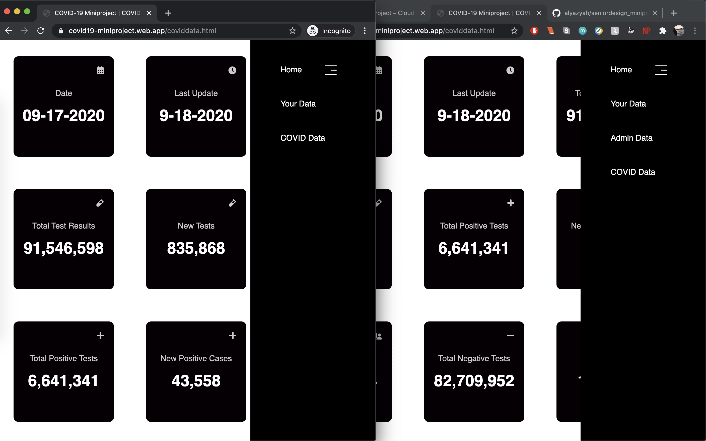
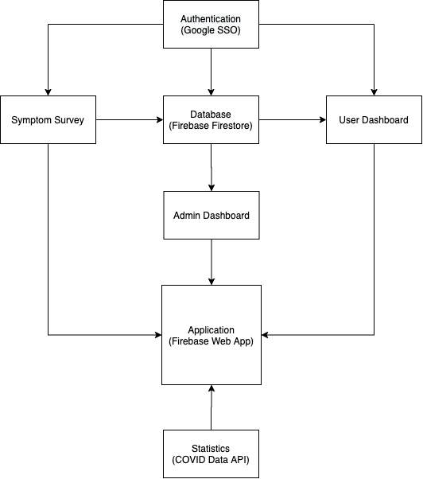
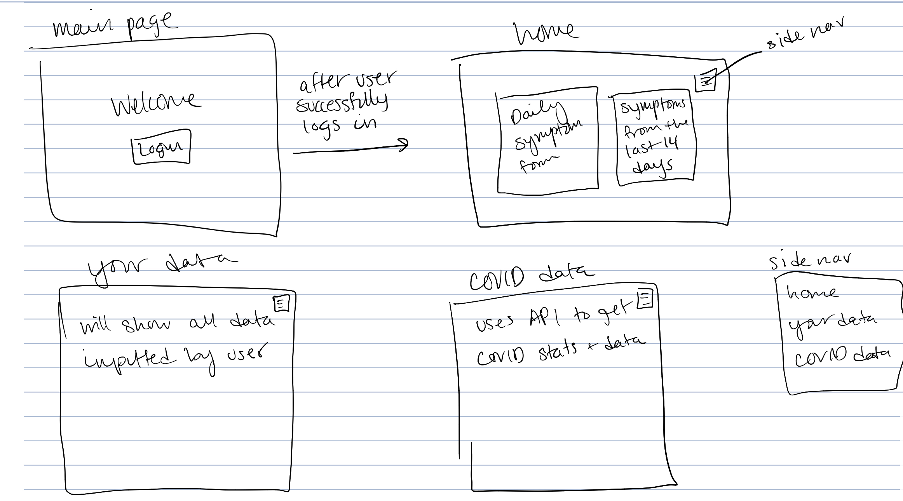
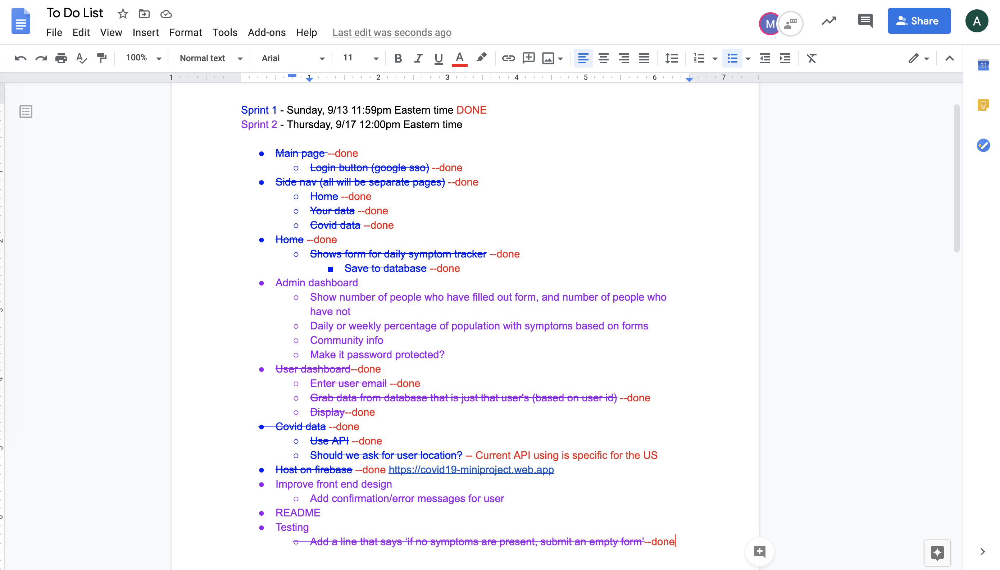

# COVID-19 Web App

Alyazyah Almarzooqi & Mohammed Alsoughayer

Our project is hosted on https://covid19-miniproject.web.app/

## Summary
For this project, we created a COVID web application that is hosted on Firebase and written in HTML, CSS, and JavaScript. The web app allows users to sign in, fill out a daily symptom test, access their data, and access COVID data in the United States. Additionally, there is an admin dashboard that will show the admin all of the data stored in the database. The COVID data uses an API and is updated everyday. Users' information and survey results are stored in the Firestore database, and authentication is done using Google SSO.

Disclaimer: This web app is not HIPAA-compliant, but it still attempts to secure the user in ways that are described in the sections below.

## Solution Design
Our entire web app is hosted on Firebase and uses many of its built-in tools, such as the Authentication (Google SSO) and Firestore. For the code, we used HTML, CSS, and JavaScript. Following the login page, we have three other pages: "Home", "Your Data", and "COVID Data". These will be shown in a navigation panel that is on the righthand side of the screen. If the user that logged in is amongst the list of admins, the "Admin Data" page is shown as well as "Your Data." Currently, our list of admins include the group members' BU emails and the three professors' BU emails. Although the admin is different from the user who takes the test, we gave the admins access to the "Your Data" page for clarity when it comes to testing the web app.

As soon as the user clicks on the website, they are prompted to sign in with Google SSO. Following a sucessful sign in, the user is redirected to the homepage of the web app, where they can take the daily symptom survey. This survey lists eight symptoms, all of which were taken from Boston University's daily symptom screen. The user can check as many symptoms as they want, or none at all, before submitting. The results, along with date and the user's unique identifier and email, are saved to the database. It should be noted that if the user is not logged in, nothing will save to the database.

The page titled "Your Data" is the page with the user dashboard. At first, the page only shows two textboxes. The first textbox asks for the user's email. If the user enters the wrong email or a different email than the one that they are currently logged in with, they will not receive the key to access the user dashboard. Upon entering the email that they are currently logged in with, the user will receive a key. Similar to the email textbox, entering the wrong key will show no results; however, entering the correct key will give the user access to the number of positive symptoms and the dates they reported feeling those symptoms. This will appear on the same page. This key is the User UID, which is unique to every email address that logs into the web app. Again, similar to the symptom test, these textboxes will not show anything if no one is logged in.

The page titled "Admin Data" is the page with the admin dashboard. This page prints out some statistics on the data entered by all the users. The statistics include:
* Number of Users
* number of Users Entered Symptoms Today  
* number of Users Didn’t Enter Symptoms Today 
* List of Users Didn’t Enter Symptoms Today
* % of Users With Each Symptom
* List of Users Experiencing Each Symptom

Here is a side-by-side comparison of what the web app looks like to users with regular access (left side – incognito window), and what the web app looks like to users with administrative access (right side – normal window):

In the "COVID Data" page, an API key is used to gather data about COVID-19 in the United States. This page lists:
* Current date
* Last update
* Total test results
* New tests
* Total positive tests
* New positive cases
* Total recovered
* Total negative tests
* Total deaths
* New deaths
* Total hospitalized
* Currently hospitalized
* Newly hospitalized

The link to the API is listed in the References section below.

Workflow diagram:

Initial sketch:

#### Sprint 1 – Sunday, 9/13
* Front end/code skeleton
* Main page and login (Google SSO)
* Daily symptom tracker form
* Database
* COVID data using API
* Deploy web app to Firebase

#### Sprint 2 – Thursday, 9/17
* User dashboard
* Admin dashboard
* Testing, with test cases indicated in the section below
* README/Report

A screenshot of our To Do List, as we were working on the miniproject:

## Test Cases
* There is a line added on the symptom survey page that tells you to submit an empty form if you show no symptoms.

* You receive a confirmation message in the web app upon submitting the symptom survey.

* If you are not logged in and try to fill out the symptom survey, you will receive a message that says, “No one is signed in.” in the console.

* If you are not logged in and try to enter an email or a key in the “Your Data” page, you will receive a message that says, “No one is signed in.” in the console.

* While logged in and on the “Your Data” page, if you enter the incorrect email (either different from the one that you are logged in with or spelled incorrectly), you will receive a message on the web app informing you that you need to enter the correct email.

* Similarly, with the key textbox on the “Your Data” page, if you enter an incorrect one, you will also receive a message on the web app to let you know.

* "Admin Data" page is only shown for users with administrative access, as seen in the screenshot in the Solutions Design section. To test this and mimic the screenshot, we recommend the users with administrative access login to our web app using their BU email in one window, and login to our web app using their personal (or any other email) in an incognito window.  

## Challenges
Throughout working on this project, we came across three main challenges and obstacles:
* Navigating HTML/CSS, JavaScript, and Firebase for the first time
* Finding a way to secure the user's information
* Managing the data in the database

The first challenge listed was the group's biggest challenge, as these were all new areas for the two of us. Nonetheless, with a lot of research and effort, we were able to solve this challenge while simultaneously learn a lot.

Securing the user's information was a huge challenge. We knew that creating a HIPAA-compliant app was not possible given the time and resources for this project, however, we attempted to do so attempted to do this by using the User UID when the user wants to access their own data in the "Your Data" page, for this can only be accessed by those with access to the project's Firebase console.

It was also difficult to know how exactly we wanted our data to look like in the database. We were unsure about what to store, but we decided on storing the User UID, email, timestamp, and an array with the checked values from the symptom survey.

For future implementations of this project, we hope to find a way to encrypt the user's identifying information before storing it, in order to make the app HIPAA-compliant. We would also implement a better front end design, as we now have more experience with web development. One final change we would make is to ensure that the user can only submit results once a day.

## References
* [Firebase Documentation](https://firebase.google.com/docs/web/setup)
* [COVID Data API](https://covidtracking.com/data/api)
* [W3Schools](https://www.w3schools.com/)
